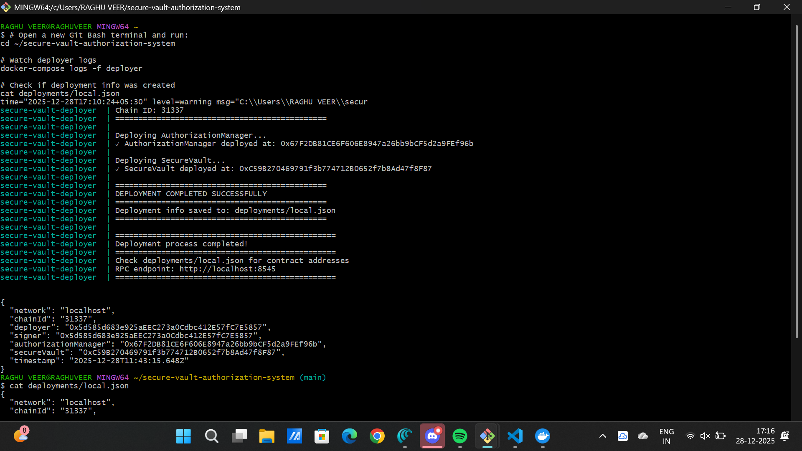

# Secure Vault Authorization System

Production-grade multi-contract vault with EIP-712 signed authorizations and single-use enforcement.

## 🏗️ Architecture

**AuthorizationManager.sol**: Validates EIP-712 signatures, tracks nonce-based single-use authorizations  
**SecureVault.sol**: Holds ETH, executes authorized withdrawals, maintains accounting

## 🔒 Security Features

✅ Single-use authorizations (nonce tracking)  
✅ Context binding (vault, chain, recipient, amount)  
✅ Reentrancy protection (CEI pattern)  
✅ Signature verification (ecrecover)  
✅ Initialization guards

## 📂 Structure

```
/
├── contracts/          # Smart contracts
├── scripts/           # Deployment scripts
├── test/              # Test suite (7 tests)
├── docker/            # Docker config
├── deployments/       # Deployment outputs
└── docker-compose.yml
```

## 🚀 Quick Start

### Docker Deployment (Recommended)

```
# Clone and deploy
git clone https://github.com/lohithadamisetti123/secure-vault-authorization-system.git
cd secure-vault-authorization-system
docker-compose up --build

# Check deployment
cat deployments/local.json
```

### Local Development

```
npm install
npm run compile
npm run test     # All 7 tests pass
```

## 🎯 Deployment Proof

### Successful Docker Deployment



**Verified Deployment:**
```
{
  "network": "localhost",
  "chainId": "31337",
  "deployer": "0x5d585d683e925aEEc273a0Cdbc412E57fC7E5857",
  "signer": "0x5d585d683e925aEEc273a0Cdbc412E57fC7E5857",
  "authorizationManager": "0x67F2DB81CE6F606E8947a26bb9bCF5d2a9FEf96b",
  "secureVault": "0xC59B270469791f3b774712B0652f7b8Ad47f8F87",
  "timestamp": "2025-12-28T11:43:15.648Z"
}
```

**Deployment Summary:**
- ✅ Blockchain: Ganache v7.9.0 on port 8545
- ✅ AuthorizationManager: Gas 615,992 (Block 6)
- ✅ SecureVault: Gas 779,743 (Block 7)
- ✅ RPC: `http://localhost:8545`

## 🧪 Tests

```
npm run test
```

```
  SecureVault Authorization System
    Initialization
      ✓ should initialize contracts correctly
    Deposits
      ✓ should accept deposits and emit events
      ✓ should reject zero deposits
    Authorized Withdrawals
      ✓ should process valid withdrawal authorization
      ✓ should reject reused authorization (replay protection)
      ✓ should reject invalid signature
      ✓ should reject withdrawal exceeding balance

  7 passing (1s)
```

## 📝 Authorization Flow

### 1. Generate Signature (Off-chain)

```
const domain = {
  name: "SecureVaultAuth",
  version: "1",
  chainId: 31337,
  verifyingContract: authManagerAddress
};

const types = {
  Withdraw: [
    { name: "vault", type: "address" },
    { name: "recipient", type: "address" },
    { name: "amount", type: "uint256" },
    { name: "nonce", type: "uint256" },
    { name: "chainId", type: "uint256" }
  ]
};

const value = {
  vault: vaultAddress,
  recipient: recipientAddress,
  amount: ethers.parseEther("1.0"),
  nonce: 1,
  chainId: 31337
};

const signature = await signer.signTypedData(domain, types, value);
const { v, r, s } = ethers.Signature.from(signature);
```

### 2. Execute Withdrawal (On-chain)

```
await vault.withdraw(recipientAddress, amount, nonce, v, r, s);
```

### Flow Diagram

```
Signer → EIP-712 Signature → SecureVault → AuthorizationManager
                                   ↓              ↓
                            Check Balance    Verify + Mark Used
                                   ↓
                            Transfer ETH → Recipient
```

## 📊 Events

```
// AuthorizationManager
event AuthorizationUsed(bytes32 indexed authHash, address indexed vault, address indexed recipient, uint256 amount);

// SecureVault
event Deposited(address indexed from, uint256 amount);
event Withdrawn(address indexed to, uint256 amount);
```

## 🔐 Security Design

**Replay Protection**: Nonce + authHash mapping prevents reuse  
**Context Binding**: Vault, chain, recipient, amount enforced  
**CEI Pattern**: Checks → Effects → Interactions  
**Signature Verification**: ecrecover validates signer  
**Balance Safety**: Cannot go negative

## 🐛 Troubleshooting

```
# Restart Docker
docker-compose down -v && docker-compose up --build

# Check logs
docker-compose logs deployer

# Verify deployment
cat deployments/local.json
```

## 📚 Resources

- [EIP-712 Specification](https://eips.ethereum.org/EIPS/eip-712)
- [Hardhat Docs](https://hardhat.org/docs)
- [OpenZeppelin Security](https://docs.openzeppelin.com/contracts/)

---

**Repository**: https://github.com/lohithadamisetti123/secure-vault-authorization-system  
**License**: MIT
